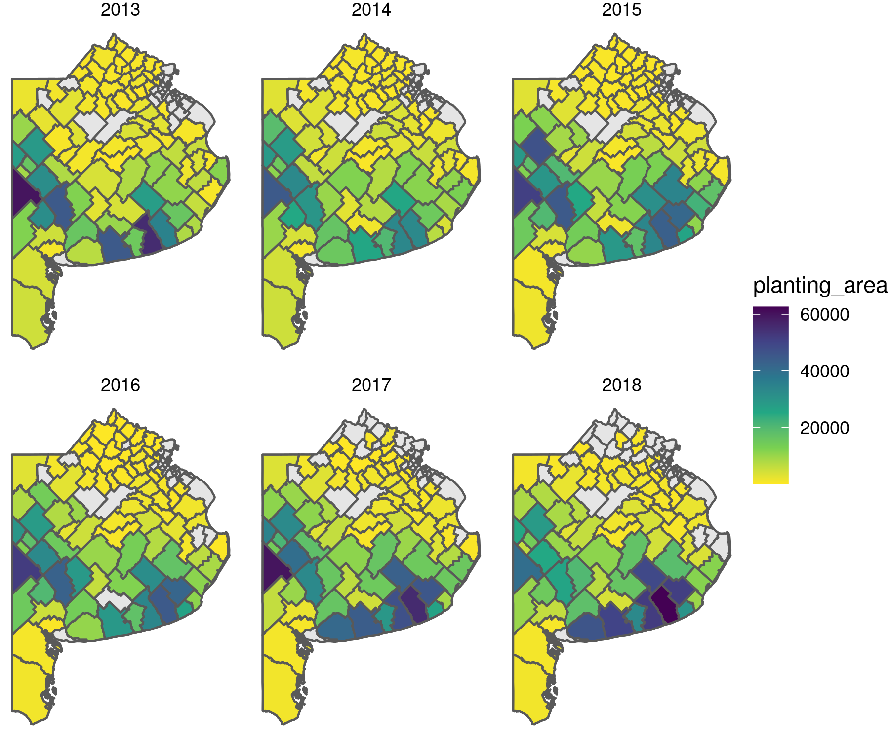
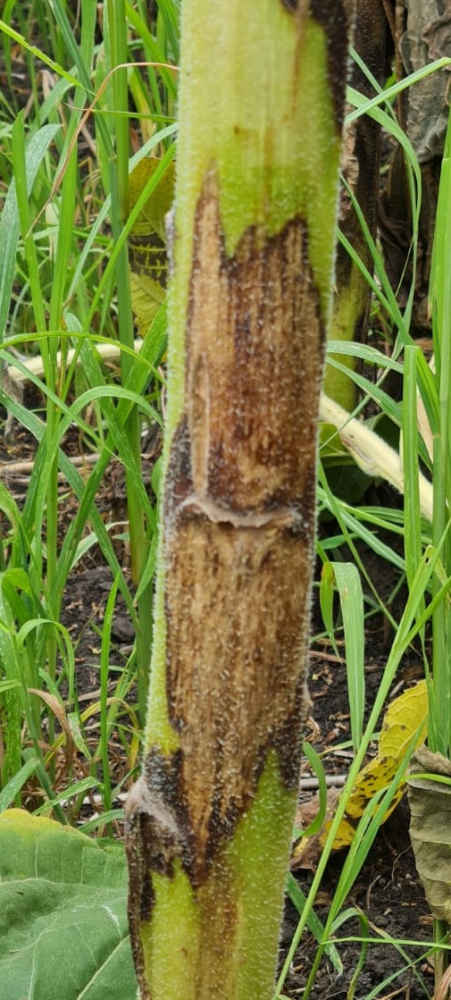
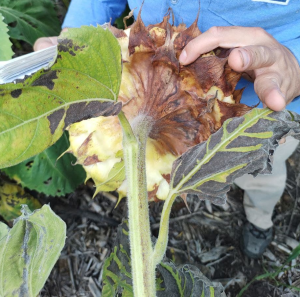
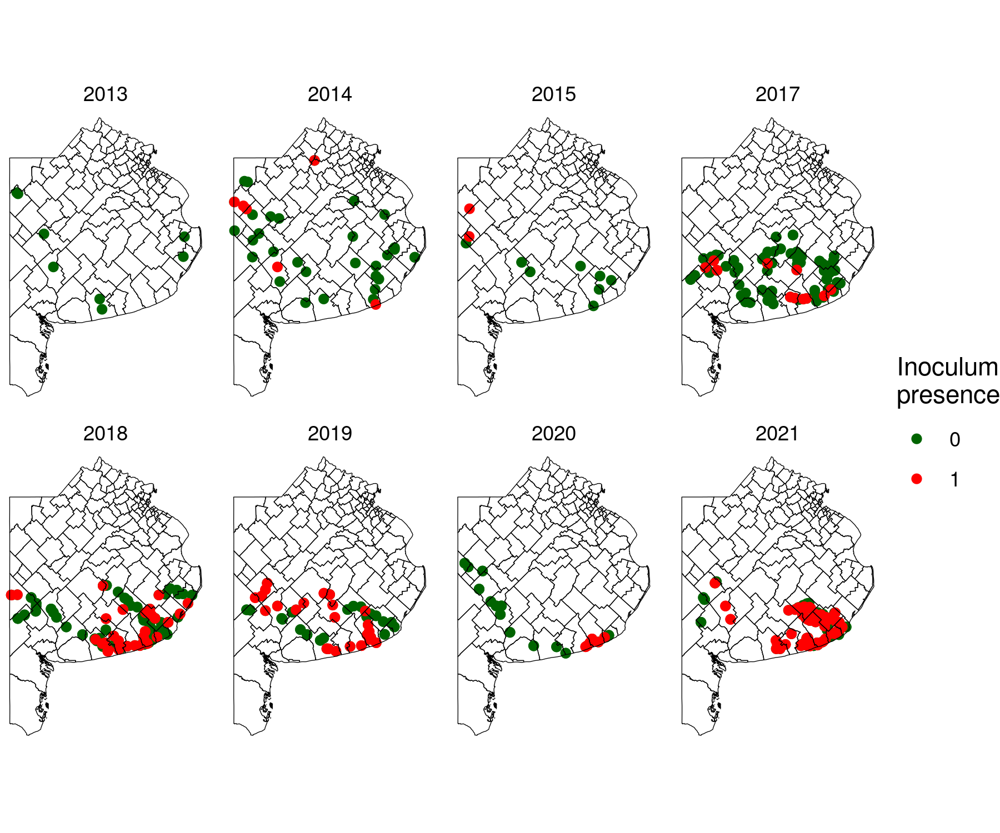
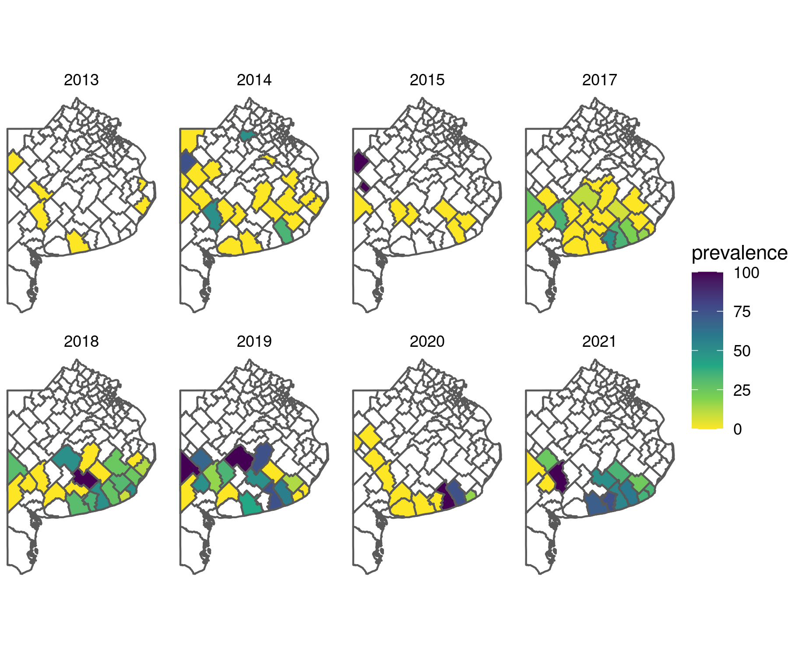

# Emergence of Diaporthe helianthi diseases of sunflower in Argentina

Buenos Aires is the main growing state of sunflower (*Helianthus annuus L.*) in Argentina 

*Diaporthe helianthi* is the main casual agent of **Phomopsis stem canker**, a widespread and yield limiting disease of sunflower. In the last few years head rot of sunflower was also observed as a consequence of *D. helianthi* infections.  

<figure>
   
   <figcaption>Fig 1: Stem canker</figcaption>
</figure>

--- 

<figure>
   
   <figcaption>Fig 2: Head rot</figcaption>
</figure>

--- 

The goal of this study is to track the evolution of D. helianthi diseases across the Buenos Aires departments, since 2013 to the present. 

Variables coding contained in dat_geo imported through `load("data/tidy_dat.RData")`

| id_variable | detail |
| ------- | ------ |
| id      | row identificator - one sampled field can have two rows of information |
| year    | year of harvest season|
| sampling_date | date of sampling  |
| previous_crop | previous_crop when reported|
| growth_stage  | crop growth stage at the sampling moment  |
| lat     | latitude |
| lon     | longitude |
| disease | stem canker or head rot |
| intensity     | disease intensity: not registered; absent; present (low; medium, or; high)  |

---

Evolution of the *D. helianthi* presence (stem canker or head rot positive fields) along the period 2013-2021 in the main sunflower growing region of Argentina (southern Buenos Aires province). 

---

Sampling fields: 

---

Department prevalence (Numbers indicate the total of sampled fields within each department)

---

For the purposes of this work, skip data wrangling (script 0) and start from data visualization script (tidy data will be available for starting the fun steps of the workflow) 
